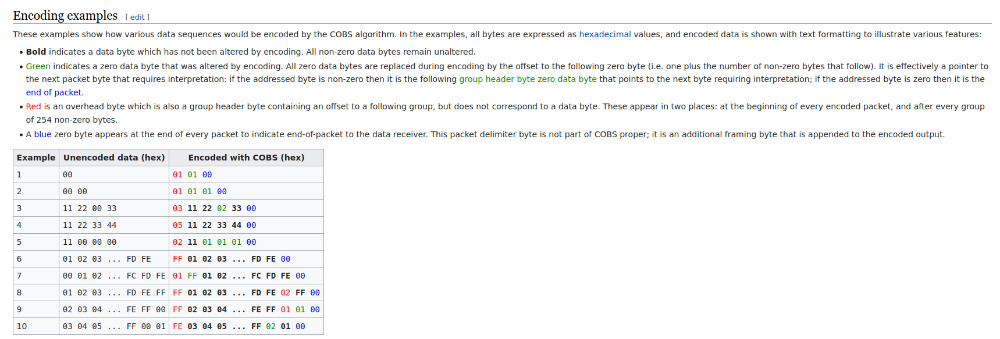

# Consistent Overhead Byte Stuffing(COBS) Library (C++)

## How To Use Library
Just copy and paste cobs.cpp and cobs.h to your project. No dependencies.  

Encoding Example:
```
#include "cobs.h"

struct customStruct {
    uint8_t a;
    uint8_t b;
};

int main(void)
{
    cobs myCobs;
    std::vector<uint8_t> encoded;
    customStruct myStruct;
    myCobs.encode(encoded, myStruct);
    return retVal;
}
```
Decoding Example:
```
#include "cobs.h"

struct customStruct {
    uint8_t a;
    uint8_t b;
};

int main(void)
{
    cobs myCobs;
    std::vector<uint8_t> encoded {0x03, 0x11, 0x22, 0x00};
    customStruct myStruct;
    myCobs.decode(&myStruct, encoded);
    return retVal;
}
```
## How Implementation Works


[Original link to wikipedia article](https://en.wikipedia.org/wiki/Consistent_Overhead_Byte_Stuffing)

## How To Run Tests
Tests use testing framework(gtest) by google. Install gtest. Run:  
```
$ cd tests 
$ make
```